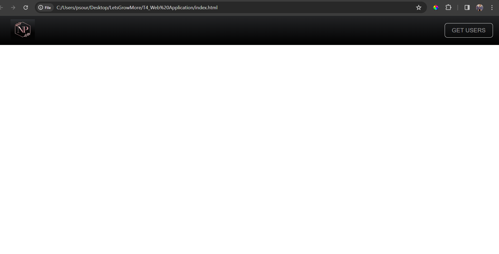
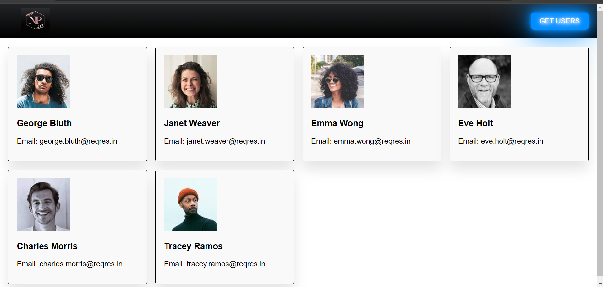

<p align="center">
  <h1 align="center">Data Fetching WebApp</h1>

  <p align="center">
    This web application allows you to fetch data from an external API by clicking on a button.!
    <br/>
    <br/>
    <a href="https://github.com/Namratapatel9027/Web-Application"><strong>Explore the Project »</strong></a>
    <br/>
    <br/>
  </p>
</p>

## Table Of Contents

* [About the Project](#about-the-project)
* [Built With](#built-with)
* [Getting Started](#getting-started)
  * [Installation](#installation)
* [Contributing](#contributing)
* [License](#license)

## About The Project

<h1 align="center">Screenshots</h1>

<!-- Add screenshots of your web application -->



This web application allows you to fetch data from an external API by clicking on a button. Whether you need to retrieve information from a remote server, display real-time data, or integrate with third-party services, this app provides a simple interface for fetching and displaying data dynamically.

Here's why:

* User-friendly Interface: The application provides a straightforward interface with a single button to initiate data fetching.
* Dynamic Data Display: Display the fetched data dynamically on the webpage, allowing users to view the information instantly.
* Button Click Action: Fetch data from the API by clicking on the designated button, providing a seamless user experience.
* Responsive Design: The application is responsive and works seamlessly across devices, including desktops, tablets, and smartphones.

## Built With

Frontend: HTML, CSS, JavaScript

## Getting Started

This is an example of how you can set up the project locally.
To get started with the Data Fetching Web Application, follow these steps:

### Installation

1. Clone the Repository: Clone this repository to your local machine using the following command:

```sh
git clone https://github.com/Namratapatel9027/Web-Application.git
```

2. Navigate to the Directory: Move into the project directory:

```sh
cd Web-Application
```

3. Open the Project: Open the project in your favorite code editor to view and customize the HTML, CSS, and JavaScript files as needed.

4. Start the Server: If you're using any backend technologies, start the server according to the setup instructions.

## Contributing

Contributions are welcome! If you find any bugs or have suggestions for new features, please open an issue or submit a pull request. For major changes, please open an issue first to discuss the proposed changes.

## License

This project is licensed under the MIT License - see the LICENSE file for details.

Thank you for choosing the Data Fetching Web Application. Happy data fetching! 🚀
